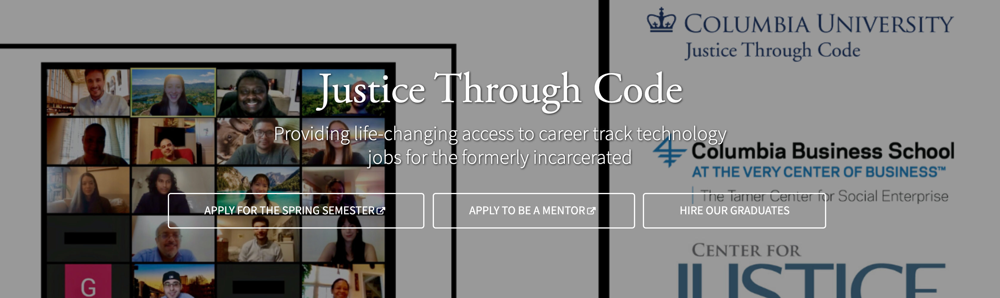

<h2 align="center">Chung Kao's</h2>
<h4 align="center">Sandwich Maker Django Project</h4>

Columbia University - Justice Through Code

## About

This is a simeple Django app that allows the user to make random combos of sandwiches. It is created to fulfill a project requirement for the Columbia University's Justice Through Code, Spring 2022 program. Participants of JTC undergo an intensive of Python programming and app development using the Django framework. This is the third of the Django projects that will have been completed before the final project and before participants move on to the career development phase of the program.

### Author

